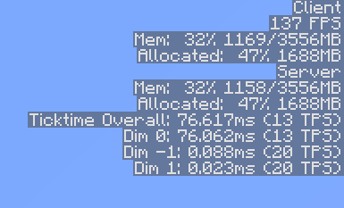

# DebugServerInfo

This is a Minecraft (1.10.2 +) mod that adds some server debug info to the client debug screen.

Suggestions & bug reports are always welcome, but please make sure there isn't a similar Github issue already.

[**Available for download from CurseForge here.**](https://minecraft.curseforge.com/projects/debugserverinfo)

